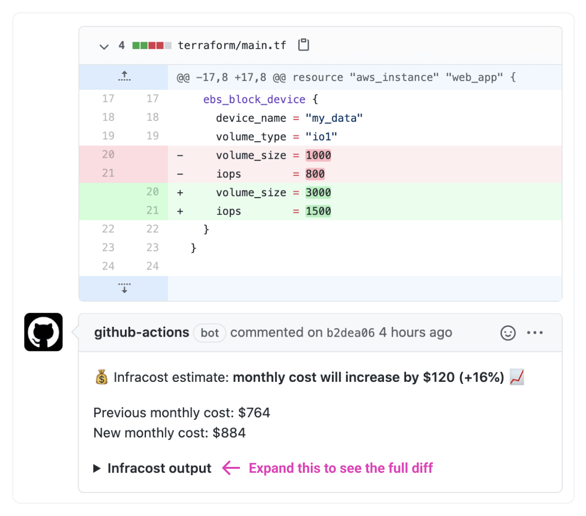

# infracost GitHub action

This action runs [infracost](https://github.com/aliscott/infracost) on the provided terraform directory in the master branch and the pull request whenever a `.tf` file changes. It automatically adds a pull request comment showing the cost estimate `diff` if a percentage threshold is crossed.



## Inputs

### `terraform_dir`

**Required** Path of the repo's terraform directory.

### `percentage_threshold`

**Optional** The absolute percentage threshold that triggers a pull request comment with the diff. Defaults to 0, meaning that a comment is posted if the cost estimate changes. For example, set to 5 to post a comment if the cost estimate changes by plus or minus 5%.

## Environment variables

The AWS secrets mentioned below are used by terraform init and plan commands. As mentioned in the repo [readme](../../../README.md): you can run `infracost` in your terraform directories without worrying about security or privacy issues as no terraform secrets/tags/IDs etc are sent to the pricing service (only generic price-related attributes are used). Also, do not be alarmed by seeing the `terraform init` in output, no changes are made to your terraform or cloud resources. As a security precaution, read-only AWS IAM creds can be used.

### `AWS_ACCESS_KEY_ID`

**Required** AWS access key ID is used by terraform init and plan commands.

### `AWS_SECRET_ACCESS_KEY`

**Required** AWS secret access key is used by terraform init and plan commands.

### `GITHUB_TOKEN`

**Required** GitHub token used to post comments, should be set to `${{ secrets.GITHUB_TOKEN }}` to use the default GitHub token available to actions.

## Outputs

### `master_monthly_cost`

The master branch's monthly cost estimate.

### `pull_request_monthly_cost`

The pull request's monthly cost estimate.

## Usage

1. [Add repo secrets](https://docs.github.com/en/actions/configuring-and-managing-workflows/creating-and-storing-encrypted-secrets#creating-encrypted-secrets-for-a-repository) for `AWS_ACCESS_KEY_ID` and `AWS_SECRET_ACCESS_KEY` to your GitHub repo. As a security precaution, read-only AWS IAM creds can be used.

2. Create a new file in `.github/workflows/infracost.yml` in your repo with the following content. You must set the `terraform_dir` value, everything else should work out of the box.
```
on:
  push:
    paths:
    - '**.tf'
jobs:
  infracost:
    runs-on: ubuntu-latest
    name: Show infracost diff
    steps:
    - name: Checkout master branch
      uses: actions/checkout@v2
      with:
        ref: master
        path: master
    - name: Checkout pull request branch
      uses: actions/checkout@v2
      with:
        ref: ${{ github.event.pull_request.head.sha }}
        path: pull_request
    - name: Run infracost diff
      uses: aliscott/infracost-gh-action@simplify_action
      env:
        AWS_ACCESS_KEY_ID: ${{ secrets.AWS_ACCESS_KEY_ID }}
        AWS_SECRET_ACCESS_KEY: ${{ secrets.AWS_SECRET_ACCESS_KEY }}
        GITHUB_TOKEN: ${{ secrets.GITHUB_TOKEN }}
      with:
        ##### You should only need to modify the following #####
        terraform_dir: PATH/TO/MY/TERRAFORM
```

## Contributing

Pull requests are welcome. For major changes, please open an issue first to discuss what you would like to change.

## License

[Apache License 2.0](https://choosealicense.com/licenses/apache-2.0/)
