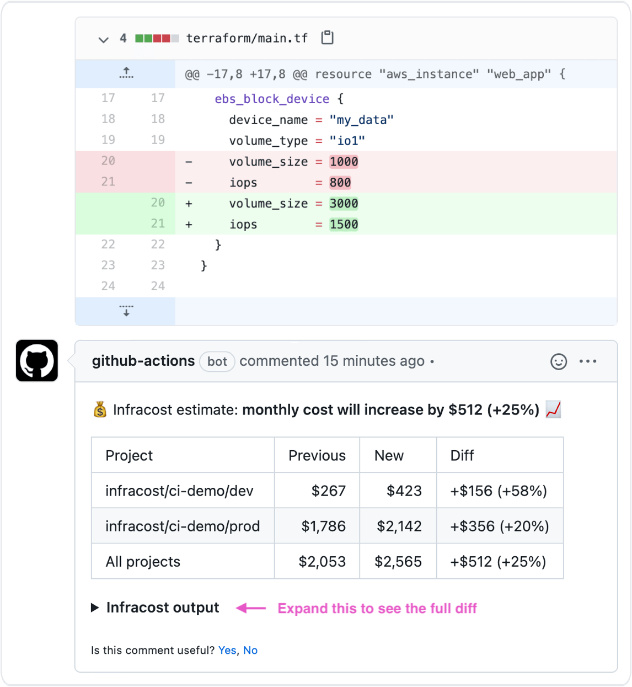

# Infracost GitHub Action

This GitHub Action runs [Infracost](https://infracost.io) against the master/main branch and the pull request whenever a Terraform file changes. It automatically adds a pull request comment showing the cost estimate difference (similar to `git diff`) if a percentage threshold is crossed. See [this repo for a demo](https://github.com/infracost/gh-actions-demo).

This Action uses the latest version of Infracost by default as we regularly add support for more cloud resources. If you run into any issues, please join our [community Slack channel](https://www.infracost.io/community-chat); we'd be happy to guide you through it.

As mentioned in the [Infracost FAQ](https://www.infracost.io/docs/faq) you can run `infracost` in your Terraform directories without worrying about security or privacy issues as no cloud credentials, secrets, tags or Terraform resource identifiers are sent to Infracost's Cloud Pricing API. Infracost does not make any changes to your Terraform state or cloud resources.



## Inputs

Infracost can be run with different options depending on the use-case, please read the [usage methods](https://www.infracost.io/docs/#usage-methods) docs, which explains how the following inputs can be used.

### `tfjson`

**Optional** Path to Terraform plan JSON file.

### `tfplan`

**Optional** Path to Terraform plan file relative to 'tfdir'. Requires 'tfdir' to be set.

### `use_tfstate`

**Optional** Use Terraform state instead of generating a plan (default is false).

### `tfdir`

**Optional** Path to the Terraform code directory (default is current working directory).

### `tfflags`

**Optional** Flags to pass to the 'terraform plan' command, e.g. `"-var-file=myvars.tfvars"`.

### `percentage_threshold`

**Optional** The absolute percentage threshold that triggers a pull request comment with the diff. Defaults to 0, meaning that a comment is posted if the cost estimate changes. For example, set to 5 to post a comment if the cost estimate changes by plus or minus 5%.

### `pricing_api_endpoint`

**Optional** Specify an alternate price list API URL (default is https://pricing.api.infracost.io).

### `usage_file`

**Optional** Path to Infracost usage file that specifies values for usage-based resources.

## Environment variables

The following environment variables are required. Other supported environment variables are described in the [Infracost docs](https://www.infracost.io/docs/environment_variables).

If the [Terraform directory method](https://www.infracost.io/docs/#1-terraform-directory) is being used with AWS, `AWS_ACCESS_KEY_ID` and `AWS_SECRET_ACCESS_KEY` should be set.

Terraform Cloud/Enterprise users should follow [this section](https://www.infracost.io/docs/terraform_cloud_enterprise). Terragrunt users should follow [this section](https://www.infracost.io/docs/terragrunt).

### `INFRACOST_API_KEY`

**Required** To get an API key [download Infracost](https://www.infracost.io/docs/#installation) and run `infracost register`.

### `GITHUB_TOKEN`

**Required** GitHub token used to post comments, should be set to `${{ secrets.GITHUB_TOKEN }}` to use the default GitHub token available to actions (see example in the Usage section).

### `TERRAFORM_BINARY`

**Optional** Used to change the path to the terraform binary or version, see [here](https://www.infracost.io/docs/environment_variables/#cicd-integrations) for the available options.

### `GIT_SSH_KEY`

**Optional** If you're using terraform modules from private Git repositories you can set this environment variable to your private Git SSH key so terraform can access your module.

### `GITHUB_API_URL`

**Optional** GitHub API URL, defaults to https://api.github.com.

## Outputs

### `default_branch_monthly_cost`

The default branch's monthly cost estimate.

### `current_branch_monthly_cost`

The current branch's monthly cost estimate.

## Usage

1. [Add repo secrets](https://docs.github.com/en/actions/configuring-and-managing-workflows/creating-and-storing-encrypted-secrets#creating-encrypted-secrets-for-a-repository) for `INFRACOST_API_KEY` and any other required credentials to your GitHub repo (e.g. `AWS_ACCESS_KEY_ID`).

2. Create a new file in `.github/workflows/infracost.yml` in your repo with the following content. Use the Inputs and Environment Variables section above to decide which `env` and `with` options work for your Terraform setup. The following example uses `tfdir` and `tfflags` so it would be the equivalent of running `terraform -var-file=myvars.tfvars` inside the directory with the terraform code.

  ```
  on:
    push:
      # This action runs on PRs, so no need to rerun it on master/main
      branches-ignore:
        - master
        - main
      paths:
      - '**.tf'
      - '**.tfvars'
      - '**.tfvars.json'
  jobs:
    infracost:
      runs-on: ubuntu-latest
      name: Show infracost diff
      steps:
      - name: Check out repository
        uses: actions/checkout@v2
      - name: Run infracost diff
        uses: infracost/infracost-gh-action@master # Use a specific version instead of master if locking is preferred
        env:
          INFRACOST_API_KEY: ${{ secrets.INFRACOST_API_KEY }}
          GITHUB_TOKEN: ${{ secrets.GITHUB_TOKEN }} # Do not change
        with:
          entrypoint: /scripts/ci/diff.sh # Do not change
          tfdir: path/to/code
          tfflags: -var-file=myvars.tfvars
  ```

3. Send a new pull request to change something in Terraform that costs money; a comment should be posted on the pull request. Check the GitHub Actions logs if there are issues.

## Contributing

Pull requests are welcome. For major changes, please open an issue first to discuss what you would like to change.

## License

[Apache License 2.0](https://choosealicense.com/licenses/apache-2.0/)
